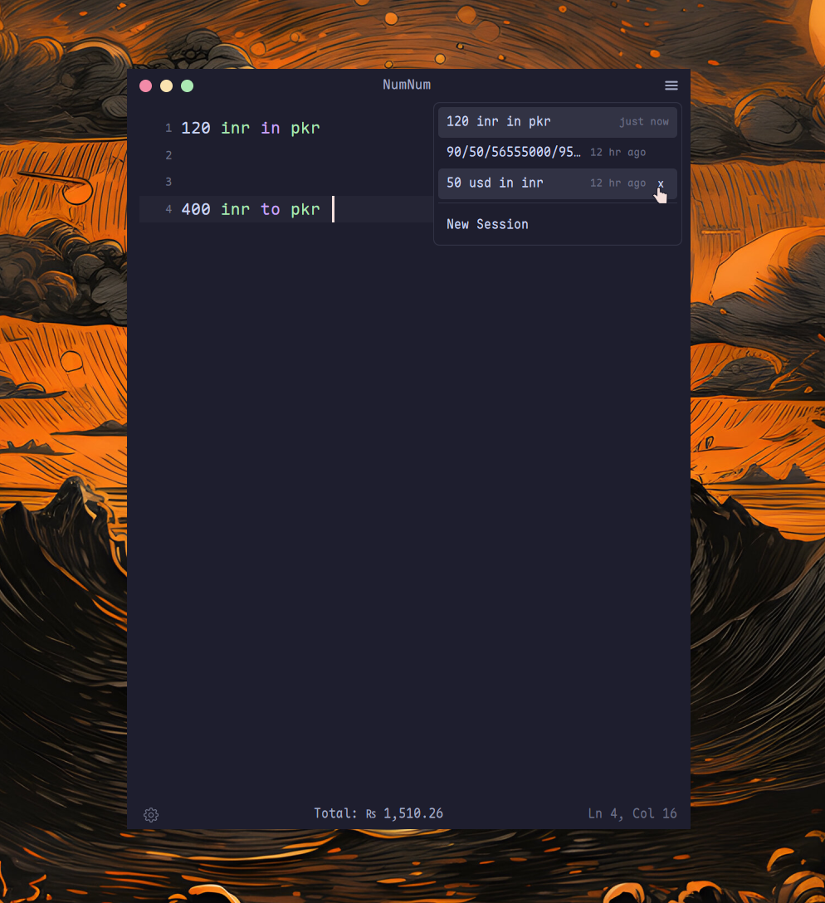

# NumNum

A text editor that does math. Type what you're thinking, get answers as you type.

No buttons, no keypad. Just a blank page that understands numbers, units, currencies, and percentages in plain language. Results appear on the right, lined up with what you wrote. Click any result to copy it.

Blazingly fast. GPU-rendered UI powered by Zed's [GPUI](https://github.com/zed-industries/zed) framework, the same engine behind the fastest code editor on the planet. Written in Rust. Open source. Cross-platform.


## How it works

```
rent = 45000 INR                              ₹ 45,000
groceries = 12000 INR                         ₹ 12,000
utilities = rent * 5%                         ₹ 2,250
total = rent + groceries + utilities          ₹ 59,250
total in USD                                  $709.28

5 m * 3 m                                    15 m²
60 km / 2 hours                               30 km/h
220 V * 10 A                                  2,200 W

500 kcal in kJ                                2,092 kJ
20% of what is 11.68 cm                       58.4 cm
0xff in decimal                               255
```

You type on the left. Results show up on the right. Change a variable and everything downstream updates. That's it.

## What it understands

**Math.** Full arithmetic with operator precedence, parentheses, and nested functions (`sin`, `cos`, `sqrt`, `log`, `abs`, `round`, 18 total). Variables persist across lines. Compound assignments (`tax += 5`) work.

**170+ currencies.** Symbols (`$`, `₹`, `€`, `£`, `¥`), ISO codes (`USD`, `INR`, `GBP`), and full names (`indian rupee`, `swiss franc`). Rates pulled live on startup, cached in SQLite, with a hardcoded fallback for offline use.

**100+ units.** Length, mass, time, temperature, area, volume, data, power, energy, voltage, current, resistance, frequency. Write `60 km / 2 hours` and get `30 km/h`. Write `220 V * 10 A` and get `2,200 W`. Shorthands like `mph`, `kmh`, `kbps` work. So does the word `per` (`100 km per hour`).

**Percentages in plain English.** `20% of 500`, `20% on 500`, `20% off 500`, `15% of what is 75`, or inline: `500 + 10%`.

**Number formats.** US (`1,234,567.89`), Indian (`12,34,567.89`), European (`1.234.567,89`). Paste formatted numbers from a spreadsheet and they parse correctly in the active locale.

**Representations.** `255 in hex`, `10 in binary`, `0xff in decimal`, scientific notation.

**Aggregation.** `sum`, `average`, `prev` reference results from earlier lines.

## The editor

NumNum is not a CLI tool or a widget. It's a proper text editor with:

- Syntax highlighting tuned for math expressions
- Autocomplete that knows every function, unit, currency, and variable in scope
- Double-click to select a word, triple-click for a line
- Undo/redo, cut/copy/paste, soft line wrapping
- Ctrl+scroll to change font size on the fly

Results on the right scroll with the editor and stay aligned, even when lines wrap. Click any result to copy it to the clipboard.

## Session persistence

Your work is automatically saved. Every calculation lives in a named session that persists across restarts. No manual save, no dialogs.

- Sessions are stored as JSON in your platform's data directory (`~/.local/share/numnum/sessions/` on Linux/FreeBSD)
- The most recent session is restored automatically when you reopen NumNum
- Click the burger menu in the top-right to switch between sessions or start a new one
- Hover over a session in the list to reveal a close button
- Empty sessions are cleaned up automatically so they don't clutter the list



## Looks

8 color themes ship out of the box: Catppuccin Mocha, Catppuccin Latte, Tokyo Night, Tokyo Night Day, Rose Pine Moon, Rose Pine Dawn, Zed One Dark, Zed One Light.

Drop a `.toml` file in `~/.config/numnum/themes/` to add your own. Dark, light, and auto (follows system) appearance modes.

Optional custom titlebar with macOS-style traffic light buttons, or use your system's native one, or go with no titlebar at all.

## Font

NumNum looks best with [Maple Mono NF](https://github.com/subframe7536/maple-font) (the default). Install it before running:

```sh
# macOS / Linux (Homebrew)
brew install --cask font-maple-mono-nf

# Arch Linux
paru -S ttf-maplemono-nf-unhinted

# Windows (Scoop)
scoop bucket add nerd-fonts
scoop install Maple-Mono-NF
```

Or grab it from the [releases page](https://github.com/subframe7536/maple-font/releases). Any monospace font works, but Maple Mono NF is what NumNum is designed around. You can change the font in settings.

## Install

Prebuilt packages for every platform are attached to each [release](https://github.com/rudrabhoj/numnum/releases).

### Linux

```sh
# Debian / Ubuntu
sudo apt install ./numnum_*_amd64.deb

# Fedora / RHEL / openSUSE
sudo dnf install ./numnum-*.x86_64.rpm

# Arch (AUR)
paru -S numnum-bin
```

Or download `numnum-x86_64-unknown-linux-gnu.tar.xz` and put the `numnum` binary on your `PATH`.

### macOS

Download `NumNum-<version>.dmg`, open it, and drag NumNum to Applications. The binary is universal, so one download runs on both Intel and Apple Silicon. It is unsigned, so the first launch needs a Control-click then Open.

### Windows

Download `numnum-x86_64-pc-windows-msvc.zip`, extract it, and run `numnum.exe`.

### FreeBSD

```sh
sudo pkg install ./numnum-*.pkg
```

Or use the `numnum-x86_64-unknown-freebsd.tar.xz` archive.

## Window manager tips (Hyprland, Niri)

NumNum is a small utility window. On a tiling Wayland compositor it feels best floating, borderless, and pinned, so it acts like a quick scratchpad instead of claiming a tile. It sets its Wayland `app-id` (and X11 `WM_CLASS`) to `numnum`, which is what these rules match on.

### Hyprland

Add to `~/.config/hypr/hyprland.conf`:

```
# NumNum calculator
windowrule = float on, match:class numnum
windowrule = pin on, match:class numnum
windowrule = border_size 0, match:class numnum
```

### Niri

Add to `~/.config/niri/config.kdl`:

```kdl
// NumNum calculator
window-rule {
    match app-id="numnum"
    open-floating true
    border {
        off
    }
    focus-ring {
        off
    }
}
```

## Building from source

### You'll need

- Rust 1.85+ (edition 2024)
- A C/C++ compiler
- CMake

Install Rust via [rustup](https://rustup.rs) if you don't have it:

```sh
curl --proto '=https' --tlsv1.2 -sSf https://sh.rustup.rs | sh
```

Plus platform-specific libraries:

### Linux (Debian/Ubuntu)

```sh
sudo apt install \
  build-essential cmake clang mold \
  libasound2-dev libfontconfig-dev libssl-dev \
  libwayland-dev libx11-xcb-dev libxkbcommon-x11-dev \
  libzstd-dev libsqlite3-dev libvulkan1 libva-dev \
  libglib2.0-dev
```

```sh
./build_install_linux_bsd.sh
```

### Linux (Fedora)

```sh
sudo dnf install \
  gcc g++ cmake clang mold \
  alsa-lib-devel fontconfig-devel openssl-devel \
  wayland-devel libxcb-devel libxkbcommon-x11-devel \
  libzstd-devel sqlite-devel vulkan-loader libva-devel \
  glib2-devel
```

```sh
./build_install_linux_bsd.sh
```

### Linux (Arch)

```sh
sudo pacman -S \
  gcc clang cmake mold \
  alsa-lib fontconfig openssl \
  wayland libxcb libxkbcommon-x11 \
  zstd sqlite vulkan-icd-loader libva \
  glib2
```

```sh
./build_install_linux_bsd.sh
```

### FreeBSD

```sh
sudo pkg install cmake llvm git alsa-lib libX11 sqlite3
```

```sh
./build_install_linux_bsd.sh
```

Set this in your shell profile to avoid GPUI performance issues on FreeBSD:

```sh
export RUST_LIB_BACKTRACE=0
```

The install script builds the release binary, copies it to `~/.local/bin/`, sets up the desktop entry and icon, and optionally configures Hyprland or Niri window rules.

### macOS

Xcode is required for Metal shader compilation and system frameworks.

```sh
xcode-select --install
brew install cmake
cargo build --release
```

### Windows

Visual Studio 2022 (or Build Tools) with the "Desktop development with C++" workload and a Windows 10/11 SDK.

```sh
cargo build --release
```

If the build can't find `fxc.exe` (HLSL shader compiler), point `GPUI_FXC_PATH` at your Windows SDK bin directory.

### Run it

```sh
cargo run --release
```

Binary lands at `target/release/numnum`.

## Configuration

Settings file: `~/.config/numnum/settings.toml` (Linux/FreeBSD), `~/Library/Application Support/numnum/settings.toml` (macOS), `%APPDATA%/numnum/settings.toml` (Windows).

Everything is configurable from the in-app settings pane (click the gear icon): font family and size, decimal precision, number format, color theme, appearance mode, titlebar style, and more.

## Built with

- [GPUI](https://github.com/zed-industries/zed) for GPU-accelerated rendering (from the Zed editor)
- [cosmic-text](https://github.com/pop-os/cosmic-text) for text shaping
- Pratt parser for expression evaluation
- SQLite for exchange rate caching

## License

NumNum is licensed under [GPLv2](LICENSE). The vendored GPUI crates are licensed under [Apache 2.0](LICENSE-APACHE).
