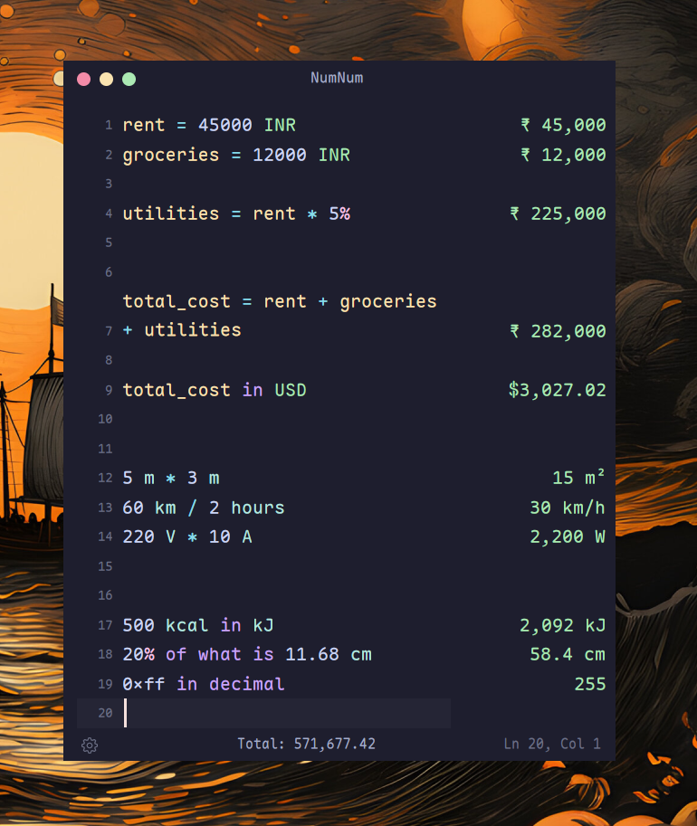

# NumNum

A text editor that does math. Type what you're thinking, get answers as you type.

No buttons, no keypad. Just a blank page that understands numbers, units, currencies, and percentages in plain language. Results appear on the right, lined up with what you wrote. Click any result to copy it.

Open source. Cross-platform. GPU-accelerated.



## How it works

```
rent = 45000 INR                              ₹ 45,000
groceries = 12000 INR                         ₹ 12,000
utilities = rent * 5%                         ₹ 2,250
total = rent + groceries + utilities          ₹ 59,250
total in USD                                  $709.28

5 m * 3 m                                    15 m²
60 km / 2 hours                               30 km/h
220 V * 10 A                                  2,200 W

500 kcal in kJ                                2,092 kJ
20% of what is 11.68 cm                       58.4 cm
0xff in decimal                               255
```

You type on the left. Results show up on the right. Change a variable and everything downstream updates. That's it.

## What it understands

**Math.** Full arithmetic with operator precedence, parentheses, and nested functions (`sin`, `cos`, `sqrt`, `log`, `abs`, `round`, 18 total). Variables persist across lines. Compound assignments (`tax += 5`) work.

**170+ currencies.** Symbols (`$`, `₹`, `€`, `£`, `¥`), ISO codes (`USD`, `INR`, `GBP`), and full names (`indian rupee`, `swiss franc`). Rates pulled live on startup, cached in SQLite, with a hardcoded fallback for offline use.

**100+ units.** Length, mass, time, temperature, area, volume, data, power, energy, voltage, current, resistance, frequency. Write `60 km / 2 hours` and get `30 km/h`. Write `220 V * 10 A` and get `2,200 W`. Shorthands like `mph`, `kmh`, `kbps` work. So does the word `per` (`100 km per hour`).

**Percentages in plain English.** `20% of 500`, `20% on 500`, `20% off 500`, `15% of what is 75`, or inline: `500 + 10%`.

**Number formats.** US (`1,234,567.89`), Indian (`12,34,567.89`), European (`1.234.567,89`). Paste formatted numbers from a spreadsheet and they parse correctly in the active locale.

**Representations.** `255 in hex`, `10 in binary`, `0xff in decimal`, scientific notation.

**Aggregation.** `sum`, `average`, `prev` reference results from earlier lines.

## The editor

NumNum is not a CLI tool or a widget. It's a proper text editor with:

- Syntax highlighting tuned for math expressions
- Autocomplete that knows every function, unit, currency, and variable in scope
- Double-click to select a word, triple-click for a line
- Undo/redo, cut/copy/paste, soft line wrapping
- Ctrl+scroll to change font size on the fly

Results on the right scroll with the editor and stay aligned, even when lines wrap. Click any result to copy it to the clipboard.

## Looks

8 color themes ship out of the box: Catppuccin Mocha, Catppuccin Latte, Tokyo Night, Tokyo Night Day, Rose Pine Moon, Rose Pine Dawn, Zed One Dark, Zed One Light.

Drop a `.toml` file in `~/.config/numnum/themes/` to add your own. Dark, light, and auto (follows system) appearance modes.

Optional custom titlebar with macOS-style traffic light buttons, or use your system's native one, or go with no titlebar at all.

## Building from source

### You'll need

- Rust 1.85+ (edition 2024)
- A C/C++ compiler
- CMake

Plus platform-specific libraries:

### Linux (Debian/Ubuntu)

```sh
sudo apt install \
  build-essential cmake clang mold \
  libasound2-dev libfontconfig-dev libssl-dev \
  libwayland-dev libx11-xcb-dev libxkbcommon-x11-dev \
  libzstd-dev libsqlite3-dev libvulkan1 libva-dev \
  libglib2.0-dev
```

```sh
./build_install_linux_bsd.sh
```

### Linux (Fedora)

```sh
sudo dnf install \
  gcc g++ cmake clang mold \
  alsa-lib-devel fontconfig-devel openssl-devel \
  wayland-devel libxcb-devel libxkbcommon-x11-devel \
  libzstd-devel sqlite-devel vulkan-loader libva-devel \
  glib2-devel
```

```sh
./build_install_linux_bsd.sh
```

### Linux (Arch)

```sh
sudo pacman -S \
  gcc clang cmake mold \
  alsa-lib fontconfig openssl \
  wayland libxcb libxkbcommon-x11 \
  zstd sqlite vulkan-icd-loader libva \
  glib2
```

```sh
./build_install_linux_bsd.sh
```

### FreeBSD

```sh
sudo pkg install cmake llvm git alsa-lib libX11 sqlite3
```

```sh
./build_install_linux_bsd.sh
```

The install script builds the release binary, copies it to `~/.local/bin/`, sets up the desktop entry and icon, and optionally configures Hyprland or Niri window rules.

### macOS

Xcode is required for Metal shader compilation and system frameworks.

```sh
xcode-select --install
brew install cmake
cargo build --release
```

### Windows

Visual Studio 2022 (or Build Tools) with the "Desktop development with C++" workload and a Windows 10/11 SDK.

```sh
cargo build --release
```

If the build can't find `fxc.exe` (HLSL shader compiler), point `GPUI_FXC_PATH` at your Windows SDK bin directory.

### Run it

```sh
cargo run --release
```

Binary lands at `target/release/numnum`.

## Configuration

Settings file: `~/.config/numnum/settings.toml` (Linux/FreeBSD), `~/Library/Application Support/numnum/settings.toml` (macOS), `%APPDATA%/numnum/settings.toml` (Windows).

Everything is configurable from the in-app settings pane (click the gear icon): font family and size, decimal precision, number format, color theme, appearance mode, titlebar style, and more.

## Built with

- [GPUI](https://github.com/zed-industries/zed) for GPU-accelerated rendering (from the Zed editor)
- [cosmic-text](https://github.com/pop-os/cosmic-text) for text shaping
- Pratt parser for expression evaluation
- SQLite for exchange rate caching

## License

NumNum is licensed under [GPLv2](LICENSE). The vendored GPUI crates are licensed under [Apache 2.0](LICENSE-APACHE).
